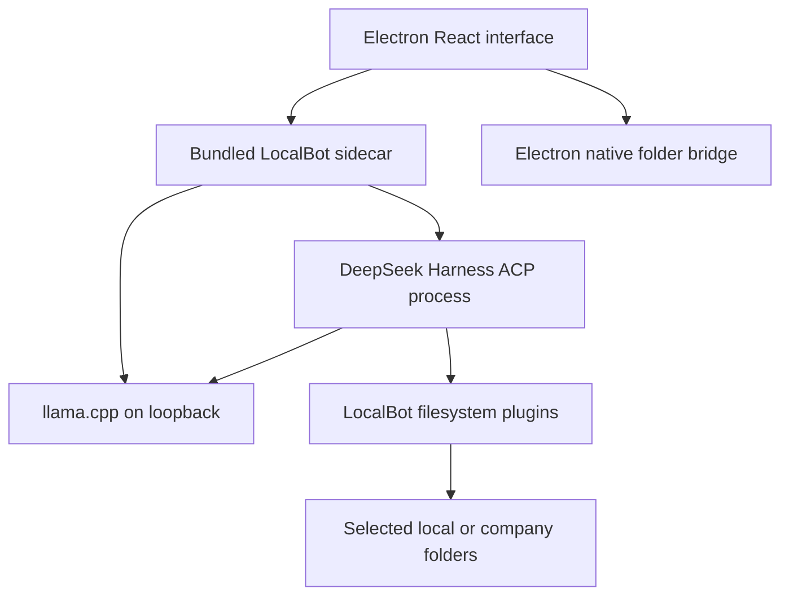

# LocalBot — Complete Product Coding Plan

**Plan date:** 2 September 2026  
**LocalBot baseline:** [`0xhughs/localbot` commit `591838e`](https://github.com/0xhughs/localbot/tree/591838eb82e37f6c608864929d6006bacb153096)  
**DeepSeek Harness baseline:** [`deepseek-ai/deepseek-harness` commit `49a606b`](https://github.com/deepseek-ai/deepseek-harness/tree/49a606bc5b5934603f22a26957a07dc799ab0291), release `0.1.2-alpha.5`

This is the implementation plan for the complete product. It is not an MVP plan, and there is no smaller release hidden inside it. LocalBot is ready only after the complete acceptance checklist at the end passes.

## 1. The product being built

LocalBot is a Grokbot-style desktop application for company employees, except the model runs on the employee's computer and the agents work through folders selected by the employee.

Any employee can install and configure LocalBot without being technical and without an IT administrator standing beside them. IT may already have created a NAS, mapped drive, SMB share, or normal company folders, but LocalBot does not require an admin service.

The complete first-use experience is:

1. The employee installs and opens LocalBot.
2. LocalBot scans the computer and recommends a local model that fits it.
3. The employee accepts the recommendation and LocalBot downloads and starts the model.
4. The employee selects the folders that represent their agent-private, employee-shared, department-shared, and company-shared work areas. Unused shared scopes can be skipped.
5. The employee creates one or more named agents and gives each a job and instructions.
6. The employee chats with an agent. The official DeepSeek Harness runs the agent, its tool calls, its session, and its work loop against the local model.
7. The agent stores work in the configured folders. Files placed in a shared folder become visible to the other employees and agents whose computers already have access to that folder.

There is no LocalBot cloud backend in this design. Work collaboration is the company's existing filesystem.

## 2. Non-negotiable boundaries

The coding work must follow these rules:

- Use the real open-source DeepSeek Harness. Do not create or retain a LocalBot imitation of its agent loop.
- Use `llama.cpp` and GGUF models for local inference. Ollama is not required and its current stub switch should be removed unless it becomes a separate requested feature.
- Do not add LocalBot RBAC, user accounts, an admin portal, a manager hierarchy, or a cloud control plane.
- Do not build a new synchronization protocol. SMB, NAS, NFS, mapped drives, mounted volumes, and ordinary local folders remain the storage and sharing mechanism.
- Do not make setup an IT-only workflow. Every installer contains the same self-service setup.
- Do not store company work in browser storage. Selected filesystem folders are the source of truth for work files.
- Do not silently fall back to a hosted model. If the local model is unavailable, show the failure and repair action.
- Do not represent employees or departments with DeepSeek Harness's experimental agent-team feature. LocalBot agents are persistent user-created agents; they collaborate through folders.

LocalBot must still stop a model from escaping the configured paths. That is path containment for agent safety, not an authorization system. Access between real people remains the responsibility of the operating system or NAS permissions already applied to those folders.

## 3. Exact folder model

Each LocalBot agent sees four logical scopes:

| Logical scope        | Actual location                                                   | Used by                                                 |
| -------------------- | ----------------------------------------------------------------- | ------------------------------------------------------- |
| `private/`           | A folder selected or created for one agent                        | That agent's drafts, memory, working files, and outputs |
| `employee-shared/`   | One folder shared by all agents belonging to the current employee | Cooperation between that employee's agents              |
| `department-shared/` | The department's existing shared folder                           | Employees and agents in that department                 |
| `company-shared/`    | The company's existing shared folder                              | Departments and agents across the company               |

The four locations do not have to share one physical parent. For example, `private/` and `employee-shared/` may live in the employee's private NAS area while the other two point to different mapped drives.

If the employee asks LocalBot to create a new structure instead of connecting existing folders, use this understandable default:

```text
Company/
  company-shared/
    General/
    Department-A/
    Department-B/
  departments/
    Department-A/
      shared/
      employees/
        Employee-1/
          shared/
          agents/
            Writer/
              private/
            Researcher/
              private/
    Department-B/
      shared/
      employees/
        Employee-2/
          shared/
          agents/
            Analyst/
              private/
```

This is a creation template, not a required company layout. The normal setup flow must accept four independently selected existing folders.

### Folder behavior

- A relative path without a scope prefix resolves inside the active agent's `private/` folder.
- The model sees the four friendly logical names, not Windows drive letters, UNC paths, or private NAS addresses.
- `..`, an absolute host path, a symlink or junction escape, and alternate path spellings that leave a configured root are rejected.
- Reads and writes use canonical paths and preserve the underlying filesystem's permissions.
- Writes are atomic where the selected filesystem supports atomic replacement.
- A stale edit is rejected if the file changed since the agent read it; the agent must reread before retrying.
- An unavailable network folder is reported as disconnected. LocalBot does not redirect the work to a local copy.
- LocalBot watches selected shared folders and refreshes the file view when another machine changes them. Because network shares do not always emit reliable native events, use `fs.watch` when it works and a bounded metadata polling fallback when it does not.

## 4. What is kept and what is replaced in the current repository

| Current area                                           | Current state at `591838e`                 | Required action                                                                |
| ------------------------------------------------------ | ------------------------------------------ | ------------------------------------------------------------------------------ |
| React dark UI, agent list, chat, settings, mascots     | Present                                    | Keep and finish                                                                |
| Electron window                                        | Present                                    | Keep as the desktop shell                                                      |
| RAM scan and GGUF recommendation                       | Present                                    | Keep, expand hardware detection, and validate recommendations on real machines |
| GGUF download/import and `llama.cpp` server            | Present                                    | Keep and productionize                                                         |
| Multiple named agents                                  | Present in renderer state                  | Keep the experience; move durable agent metadata out of `localStorage`         |
| Folder storage                                         | One generated company root and grant model | Replace with four independently selected folder connections per employee/agent |
| Native folder picker and shared-folder refresh         | Missing                                    | Build                                                                          |
| `src/runtime/harnessAdapter.ts`                        | A custom six-round loop                    | Delete and replace with a thin official ACP client                             |
| Real DeepSeek Harness dependency/runtime               | Missing                                    | Bundle and integrate the pinned upstream runtime                               |
| Live activity updates and real stop                    | Missing                                    | Drive semantic updates and cancellation through official ACP                   |
| Chat history                                           | Renderer `localStorage`                    | Use Harness session persistence and a small host-side agent/session index      |
| Hosted Grok demo code                                  | Still present                              | Remove from the production product                                             |
| Auth, database, PWA, and multiplayer template remnants | Unused leftovers                           | Remove after import checks prove they are unused                               |
| Packaged desktop build                                 | Unsigned unpacked directory                | Produce signed/notarized installers and Linux packages                         |
| Package name                                           | `app-builder-workspace`                    | Rename to `localbot` and establish real versioning                             |

## 5. Final runtime architecture



The React interface remains the product UI. Keep the current bundled Nitro sidecar as the local host because it already lets the packaged app run without a global Node installation. Extend it to own durable config, model downloads, the Harness ACP connection, folder operations, and folder watchers. Electron main/preload owns only operations that require the native desktop process, such as folder pickers, Finder/Explorer reveal, and application lifecycle.

Keep both the sidecar and `llama.cpp` bound to loopback. Give the sidecar a random per-launch token and validate the Electron renderer's requests so another local webpage cannot call its privileged endpoints. The renderer never calls `llama.cpp` or DeepSeek Harness directly. The sidecar launches Harness over stdio ACP and publishes chat/tool events to the renderer through one authenticated streaming endpoint.

Use typed, narrow renderer-to-host methods such as:

```text
setup.scanHardware
models.list / download / import / activate
folders.pick / validate / watch / reveal
agents.create / update / archive
agents.prompt / cancel / resume
agents.onEvent / onPermissionRequest
```

Do not expose raw Node, Electron, shell, or arbitrary filesystem functions to the renderer. Native picker results still pass through the sidecar's folder validation before becoming configured roots.

## 6. Real DeepSeek Harness integration

### 6.1 Use the official ACP application surface

Launch the bundled Harness as:

```text
dsh --profile acp --patch <localbot-acp.cordis.yml>
```

Connect from the LocalBot host with `@agentclientprotocol/sdk`.

This is the correct upstream surface for LocalBot because the official ACP implementation already supports:

- several independent sessions over one Harness process;
- `session/new`, `session/list`, `session/resume`, and `session/close`;
- `session/prompt` and semantic `session/update` events for committed messages, thoughts, tool lifecycle, and context usage;
- actual `session/cancel` handling;
- `session/request_permission` with one-shot allow or reject decisions;
- per-session model selection;
- durable Harness sessions and tool lifecycle updates.

Do not base LocalBot on `@deepseek-ai/dsh-sdk-client`. At the pinned version, that separate SDK transport has no mid-turn cancel and no functioning server-to-client approval request path. ACP already provides both, so modifying the Harness protocol is unnecessary.

ACP `0.1.2-alpha.5` intentionally does not expose raw provider token deltas. It emits committed assistant message/thought blocks and live generic tool lifecycle updates. LocalBot must show honest working/tool status and then render the committed answer; it must not simulate token streaming. Token-level UI streaming is not required by the product described here. If it is requested later, it must be added through a supported upstream Harness/ACP change, not by reintroducing a LocalBot loop.

### 6.2 What DeepSeek Harness owns

The upstream Harness owns:

- the agent loop;
- model requests and provider streaming inside Harness;
- tool-call execution order;
- tool results returned to the model;
- session event history;
- cancellation propagation;
- context compaction;
- retries and turn completion;
- permission request coordination;
- internal subagent behavior if it is deliberately enabled later.

LocalBot must not add a second `while` loop around model calls, impose its own six-round limit, reconstruct tool messages, or replay a separate copy of chat history into the model.

LocalBot owns only the product integration:

- starting and stopping the pinned Harness process;
- creating or resuming one Harness session for each LocalBot conversation;
- mapping ACP updates into LocalBot chat text, status, and tool cards;
- showing an ACP permission request and returning the employee's choice;
- sending ACP cancellation when Stop is clicked;
- supplying the local model route and LocalBot plugins through the Cordis profile patch;
- maintaining the mapping `LocalBot agent/conversation -> Harness sessionId`.

### 6.3 Pinned runtime and packaging

Start integration against `@deepseek-ai/dsh` `0.1.2-alpha.5` and commit `49a606b`. Pin exact versions of the Harness packages and `@agentclientprotocol/sdk`; do not use floating ranges.

Bundle the complete runtime with every installer. The employee must not install Node, pnpm, DeepSeek Harness, or a command-line tool.

DeepSeek Harness currently requires Node `^22.19.0 || >=24.0.0`. Upgrade Electron to a maintained release whose embedded Node satisfies that range, launch `dsh` with Electron's Node mode, and make the packaging test assert the actual embedded Node version. If a target Electron build cannot satisfy the requirement, include a compatible Node runtime for that platform inside the installer. Never fall back to a global `node` on `PATH`.

Set a dedicated `DSH_HOME` under LocalBot's application-data directory. Explicitly disable Harness telemetry and every hosted/provider route that LocalBot does not use. Include the Harness MIT license and required third-party notices in the application.

### 6.4 LocalBot Cordis profile patch

Create a checked-in, tested `dsh/localbot-acp.cordis.yml` that:

1. Keeps the official `dsh-base` agent loop and ACP application.
2. Configures `@deepseek-ai/dsh-llm-pi-ai` with one hand-declared OpenAI-compatible provider named `localbot-llama`.
3. Reads the loopback URL, active catalog model id, context window, and maximum output from environment values supplied by LocalBot.
4. Selects `localbot-llama` in the ACP row.
5. Replaces the built-in single-root filesystem provider with the LocalBot scoped-filesystem plugin described below.
6. Adds only the missing LocalBot file-operation tools through the official Harness tool registry.
7. Keeps Harness session persistence, compaction, observation tracking, and permission services.
8. Keeps a sandboxed shell only inside the active agent's private workspace, with ACP permission prompts for actions that require approval.
9. Disables DeepSeek hosted inference, web search/fetch, feedback telemetry, and unused experimental surfaces in the LocalBot profile.

The local provider configuration uses `api: openai-completions` and the private `llama.cpp` `/v1` endpoint. If the underlying OpenAI-compatible client requires a key-shaped value, LocalBot supplies a fixed non-secret local placeholder; there is still no API key or hosted authentication.

### 6.5 LocalBot filesystem plugin for Harness

DeepSeek Harness's built-in `fs-local` `cwd` is only a resolution default, not containment, and its sandbox provider has one primary workspace. LocalBot needs four independent roots. Implement an out-of-tree Cordis plugin using Harness's official `ctx.fs` service contract; do not change `agent-loop`.

The plugin must:

- resolve `private/`, `employee-shared/`, `department-shared/`, and `company-shared/` to the current session's configured host paths;
- use the ACP session's absolute `cwd` to identify the active agent and load that agent's scope manifest;
- return stable target and version identities;
- implement bounded text and byte reads, listing, atomic text write, literal edit, metadata, and containment;
- preserve Harness stale-write protection and read-before-edit observation behavior;
- reject host absolute paths, traversal, malformed scope names, and symlink/junction escapes;
- expose logical display paths in tool results instead of leaking host paths;
- translate operating-system errors into Harness `FsError` codes;
- work with local disks, UNC paths, mapped drives, SMB/NFS mounts, and removable drives where the operating system exposes normal filesystem calls.

The scope manifest is generated by the LocalBot sidecar and stored under LocalBot application data, outside every model-writable scope. The model cannot edit it to redirect a logical scope. Treat the agent's `AGENTS.md` instructions file as user-managed and read-only to model-facing file tools.

Keep the official `dsh-tool-fs`, `dsh-tool-fs-search`, and observation-policy plugins as the model-facing tools. Harness's filesystem contract does not currently provide delete, rename, copy, directory creation, or watch. Add those missing actions as a separate LocalBot Harness tool plugin registered through `ctx.tools.register()`. Those tools must reuse the same scoped resolver. Delete remains a confirmed action; watch remains a host/UI facility rather than an open-ended model tool.

### 6.6 Agent and Harness session mapping

One Harness ACP process can serve all LocalBot agents. For each agent:

- set its `private/` folder as the ACP session `cwd`;
- store its role and standing instructions in `AGENTS.md` inside that private folder so the standard Harness instruction loader discovers them;
- create a Harness session on the first conversation and persist its `sessionId` in the LocalBot agent index;
- resume that session after app restart instead of replaying messages from renderer state;
- create a fresh Harness session only when the employee explicitly starts a new conversation;
- close the active session cleanly when deleting a conversation, while leaving work files untouched unless the employee separately chooses to remove them.

Harness's JSONL conversation logs remain under LocalBot application data by default. They are small metadata/history files; company work products remain in the selected folders. This avoids relying on hard-link and single-writer behavior that may not be available on every NAS. Models, the inference runtime, and application binaries also remain local because local inference requires them.

### 6.7 Upstream risk handling

DeepSeek labels Harness `0.1.2-alpha.5` experimental developer-preview software, says it has not been security audited, and does not promise migration for its current session format. Treat that as a release constraint:

- pin the exact accepted build;
- keep the LocalBot integration behind ACP and Cordis extension points so upgrades do not fork the loop;
- run the complete Harness contract suite against any proposed upgrade;
- retain the previous runtime until session resume, tools, cancellation, permissions, and path containment all pass;
- block the production release until LocalBot's own filesystem and process-boundary review is complete.

## 7. Local model system

### 7.1 Hardware scan

Keep hardware inspection in the trusted LocalBot sidecar and collect real values:

- OS and CPU architecture;
- total and available RAM;
- CPU cores and instruction support where useful;
- GPU family and detectable VRAM;
- Apple Silicon/Metal availability;
- CUDA or Vulkan availability when a packaged `llama.cpp` build supports it;
- free space in the selected model directory.

No fixed “16 GB” assumption is allowed. The scan result feeds one catalog function that determines which model cards are enabled and which one is recommended.

### 7.2 Qualified model catalog

Keep a signed/versioned catalog of ungated GGUF models with:

- exact repository and filename;
- exact byte size and SHA-256;
- license;
- context window;
- expected runtime memory;
- minimum free disk;
- supported chat template and tool-calling result;
- compatible `llama.cpp` runtime version and flags.

The current 0.5B, 1.5B, 3B, and 7B choices may remain only after real Harness qualification. A model is not “supported” merely because it returns chat text. It must complete the file-tool acceptance scenarios with the official Harness. The 3B tier should be the normal recommendation on a verified 16 GB laptop; 0.5B remains the low-memory fallback and must be labelled honestly if its tool reliability is limited.

### 7.3 Download and runtime management

Finish the existing download manager so it provides:

- resumable `.partial` downloads;
- visible progress, speed, remaining size, pause, resume, and cancel;
- disk-space check before download;
- checksum and GGUF-header verification before activation;
- safe cleanup of failed partials;
- import of an existing GGUF with the same verification;
- a selectable model storage folder;
- repair/redownload of a missing or corrupt runtime;
- no model deletion without confirmation.

Package a compatible `llama.cpp` runtime with each platform build when practical; otherwise use a signed asset manifest and checksum the downloaded runtime before execution. Start `llama-server` on `127.0.0.1` using an available private port, never `0.0.0.0`. Configure the correct chat template/tool mode, context size, thread count, GPU layers, and memory-mapping options from the catalog and hardware result.

Use one active local model server per employee installation. All agents can share that server, while Harness sessions keep their identities and histories separate. A model change applies to subsequent turns after the new server passes its health check.

### 7.4 Runtime states

The interface must present nontechnical states with direct recovery actions:

```text
Scanning computer
Model recommended
Downloading model
Verifying model
Starting local model
Ready
Shared folder disconnected
Model stopped — Restart
Not enough memory — Choose smaller model
Download failed — Resume
```

Do not show raw stack traces as the primary error and do not offer a hosted fallback.

## 8. Installation and onboarding

### 8.1 Installer

Ship:

- signed and notarized macOS `.dmg` builds for Apple Silicon and Intel where supported;
- a signed Windows x64 installer;
- Linux AppImage and `.deb` packages;
- all required LocalBot, DeepSeek Harness, Node/Electron, and `llama.cpp` runtime pieces;
- no dependency on Node, npm, Python, Git, a terminal, or an API key on the employee's machine.

### 8.2 First-run wizard

Use plain-language steps:

1. **Welcome** — explain that the model runs on this computer and work goes to selected folders.
2. **Computer check** — run the real hardware scan.
3. **Choose a model** — preselect the recommendation; show download size and expected capability.
4. **Download and verify** — complete before continuing, or import a GGUF.
5. **About you** — local display labels for company, department, and employee; no account is created.
6. **Connect folders** — native pickers for the parent that will hold this employee's agent-private folders, employee-shared, department-shared, and company-shared. Allow optional shared scopes to be skipped.
7. **Test folders** — read test, optional write test, free-space check, and clear permission/disconnection result.
8. **Create first agent** — name, job, instructions, and mascot.
9. **Ready** — open chat with a short example task.

Offer two folder choices without creating an administrator concept:

- **Connect existing folders:** select the paths already supplied by the company or IT.
- **Create my folders:** choose a parent and let LocalBot create the suggested employee/agent structure.

All selections remain editable in Settings. Changing a folder never moves existing files automatically; LocalBot explains the old and new locations and lets the employee move files separately if desired.

## 9. Agent experience

### 9.1 Agent registry

Store a small, versioned LocalBot configuration under application data rather than `localStorage`. Each agent record contains:

```text
id
name
job
standing instructions
mascot/color
private folder
employee/department/company folder connection ids
Harness session ids
created/updated timestamps
archived flag
```

Support creating multiple agents, renaming them, editing instructions, archiving them, and starting a new conversation. Do not invent departments or other employees in LocalBot. The current employee's company and department labels exist only to make the selected folders understandable.

### 9.2 Chat

Replace the custom adapter with an ACP presentation adapter:

- user input becomes `session/prompt`;
- committed assistant text/thought updates render exactly as ACP delivers them;
- ACP tool lifecycle becomes the current tool chips;
- ACP permission requests become a simple Allow once / Deny card;
- Stop sends `session/cancel` immediately;
- completion uses the ACP stop reason;
- restart uses `session/list` and `session/resume`;
- model, Harness, folder, and tool failures display separately with a retry or repair action.

Do not keep a second authoritative transcript in Zustand. The renderer may cache the currently displayed projection, but the Harness session log is the conversation source of truth.

### 9.3 Computer/files drawer

The existing drawer becomes a four-scope file browser:

- separate Private, My agents, Department, and Company sections;
- connection status and actual selected location available on demand;
- refresh, search, open, reveal in Finder/Explorer, and copy path;
- external changes appear without restarting the app;
- binary files can be listed, opened in the operating system, copied, moved, and deleted even when the model-facing Harness text tools cannot edit their contents.

## 10. Folder-based collaboration

Collaboration remains deliberately simple.

### Same employee, multiple agents

1. Agent A writes a result to `employee-shared/`.
2. The watcher refreshes the shared view.
3. Agent B can read that file on its next task.

The existing `@AgentName` convenience may remain for agents on the same LocalBot installation, but it should create a normal task Markdown file in `employee-shared/`; it is not a separate messaging system.

### Two employees in the same department

1. Employee A and Employee B independently connect LocalBot to the department's real shared folder.
2. Employee A's agent writes a file to `department-shared/`.
3. The company filesystem makes that file visible on Employee B's machine.
4. Employee B's LocalBot detects it and their agent can read it.

### Two departments

1. Each employee connects the company-wide shared folder.
2. An agent publishes a file to `company-shared/`, optionally inside its department's subfolder.
3. Agents in the other department can read it through the same company share.

LocalBot does not route the file through a server, duplicate it into a database, or assign permissions. If Employee B cannot read it in Explorer/Finder, LocalBot must report the underlying filesystem error rather than pretending to grant access.

## 11. Durable configuration and migration

Create a versioned host-side configuration with atomic writes and automatic backup of the previous version. Separate it into:

- installation and UI settings;
- model catalog/runtime state;
- folder connections;
- agent metadata and Harness session mappings.

On first launch of the rewritten build:

1. Read the existing `localbot-state-v3` data once.
2. Import valid agents, names, mascots, instructions, and the current company root.
3. Offer the current paths as proposed folder connections instead of silently assuming the old grant layout is correct.
4. Leave all existing company files where they are.
5. Write a migration marker only after the new config is safely committed.
6. Retain a recoverable export of the old local state until the employee confirms the migration.

Do not migrate custom-loop chat history into Harness as if it were native Harness history. Preserve it as a read-only archived transcript and begin a real Harness session.

## 12. Coding work in implementation order

Every stage below is required for the final release.

### Stage 1 — Freeze the product contract and clean the host boundary

- Add this product definition and folder contract to the repository.
- Rename the package and establish versioned config schemas.
- Create typed sidecar APIs plus a narrow Electron preload/IPC bridge for native OS actions.
- Move durable config and privileged runtime state out of renderer `localStorage` and into the sidecar.
- Add one-time migration from existing localStorage.
- Remove verified-unused auth, database, PWA, multiplayer, and hosted-demo code.
- Keep all current user files intact.

**Completion gate:** the existing UI runs in Electron, privileged sidecar endpoints require the per-launch renderer token, native actions use the preload bridge, and no hosted model path remains.

### Stage 2 — Build the four-scope folder service

- Implement native folder pickers and selected-path validation.
- Implement the independent connection model and suggested-layout creation.
- Implement canonical containment, symlink/junction tests, atomic writes, stale versions, and clear filesystem errors.
- Implement native watching with network-share polling fallback.
- Rebuild the Computer drawer around the four scopes.
- Add reveal/open operations through Electron.

**Completion gate:** two ordinary applications pointed at the same test share see each other's files, while traversal and scope-escape tests fail closed.

### Stage 3 — Integrate the actual DeepSeek Harness

- Add exact pinned Harness and ACP SDK dependencies.
- Package and launch `dsh --profile acp` with an isolated `DSH_HOME`.
- Create the LocalBot Cordis patch and the local `llama.cpp` provider route.
- Implement the scoped `ctx.fs` provider and missing file-operation tool plugin.
- Replace `harnessAdapter.ts` with a thin ACP process/session adapter.
- Map ACP updates, tool lifecycle, permissions, cancellation, close, list, and resume to the UI.
- Delete the custom model/tool loop and its round-limit behavior.
- Explicitly disable Harness telemetry, hosted routes, and unused network tools.

**Completion gate:** repository search shows no LocalBot-owned agent loop; a real ACP session with a local GGUF can read, write, edit, search, cancel, request permission, restart, and resume.

### Stage 4 — Finish local model selection and execution

- Expand hardware and GPU detection.
- Qualify every catalog model with real Harness tool scenarios.
- Finish resumable/verified model and runtime downloads.
- Add dynamic loopback port selection and robust process cleanup.
- Calibrate context, threads, GPU layers, and memory estimates.
- Add human-readable recovery states.

**Completion gate:** clean 4 GB, 8 GB, 16 GB, and higher-memory test machines receive accurate choices and complete the tasks their selected tier claims to support without a cloud key.

### Stage 5 — Finish agents and collaboration

- Move the roster and session map to durable host config.
- Store each agent's instructions in its private workspace.
- Support multiple agents and new/resumed conversations.
- Complete four-scope browsing and external-change notifications.
- Preserve file-based `@AgentName` handoff for same-installation agents.
- Test same-employee, same-department, and cross-department file handoffs on real shared storage.

**Completion gate:** all collaboration acceptance scenarios in Section 14 pass on at least two physical computers.

### Stage 6 — Package the complete desktop product

- Keep the bundled Nitro sidecar and prove it never calls a global `npm` or `node` in packaged mode.
- Bundle the accepted Electron/Node runtime, DeepSeek Harness, LocalBot plugins, sidecar, and `llama.cpp` runtime.
- Produce platform-native icons, metadata, licenses, and uninstall behavior that leaves employee work folders alone.
- Build signed/notarized macOS and Windows installers plus Linux packages.
- Add release CI, artifact checksums, smoke installation, and clean-machine tests with no developer tools installed.

**Completion gate:** a nontechnical tester can install, choose a model, connect folders, create an agent, and create a shared file without opening a terminal.

### Stage 7 — Release proof and hardening

- Run the complete automated and manual matrix below.
- Review the scoped filesystem and process launch boundaries.
- Capture outbound network traffic and prove runtime chat stays local.
- Dogfood the recommended 3B model on normal 16 GB employee laptops.
- Test network interruption, app crash, model crash, Harness crash, and recovery.
- Freeze the exact accepted dependency/runtime manifest.

**Completion gate:** every item in the final acceptance checklist is evidenced by a test result, installer artifact, or recorded manual run. Only then is the product complete.

## 13. Required test matrix

### Automated tests

- Config schema, backup, and migration tests.
- Hardware recommendation tests at catalog boundaries.
- Model download resume, checksum, corrupt-file, and insufficient-space tests.
- `llama.cpp` launch, loopback-only, health, crash, and restart tests.
- Scope resolver tests for Windows, macOS, Linux, UNC, mapped drive, traversal, casing, Unicode, symlinks, and junctions.
- Concurrent file edit and stale-version tests.
- Folder watcher tests including polling fallback.
- Official ACP process tests for initialize, session create/list/resume/close, prompt, updates, permission request, cancel, and process teardown.
- Real composed-profile smoke tests, not only mocked Cordis plugins.
- Tests proving hosted adapters, telemetry, and web tools are absent or disabled in the LocalBot profile.
- Installer tests proving no global Node, npm, Python, or DeepSeek installation is used.

### Real model tests for every supported catalog entry

- Answer an ordinary chat question.
- Create `hello.md` in `private/`.
- Read a file, then edit it correctly.
- Search for a known file and quote the relevant section.
- Read from `employee-shared/` and write a response there.
- Read from `department-shared/` and publish a result.
- Read from `company-shared/` and publish into the correct subfolder.
- Recover from a malformed tool call without corrupting a file.
- Stop a long turn and leave the session usable.
- Resume the same conversation after application restart.

Record pass rate, time to first token, tokens per second, peak RAM, and whether each tool action was correct. A model that cannot reliably pass the claimed tasks must be removed or labelled as limited.

### Physical-device and shared-storage tests

- macOS Apple Silicon laptop.
- macOS Intel if it remains a supported release target.
- Windows x64 laptop with a mapped drive and UNC path.
- Linux x64 desktop with an SMB or NFS mount.
- 4 GB low-end test machine or equivalent constrained environment.
- 16 GB normal employee laptop with the recommended 3B model.
- Two employee machines in one department share.
- Two department folders plus one company-wide share.
- NAS disconnect and reconnect while LocalBot is open.
- Two agents edit the same shared file and receive a stale/conflict result instead of silent overwrite.

## 14. Final acceptance checklist

The product is complete only when all of these statements are true:

- [ ] A nontechnical employee installs LocalBot without Node, a terminal, or an API key.
- [ ] First launch scans the real machine and recommends a model that actually fits.
- [ ] The employee downloads or imports the model and the local `llama.cpp` server becomes ready.
- [ ] No normal chat content leaves the computer, and no hosted fallback is present.
- [ ] The employee can select existing local, mapped, mounted, or NAS folders with native pickers.
- [ ] The employee can configure agent-private, employee-shared, department-shared, and company-shared locations independently.
- [ ] The employee can create and use multiple named agents.
- [ ] The real DeepSeek Harness owns the agent loop; the old six-round loop is gone.
- [ ] ACP provides live updates, tool lifecycle, permission requests, actual Stop, and session resume.
- [ ] An agent can read, search, create, and edit files in every configured scope.
- [ ] An agent cannot escape a configured scope with absolute paths, traversal, symlinks, or junctions.
- [ ] Same-employee agents collaborate through `employee-shared/`.
- [ ] Two employees in the same department collaborate through the real department folder.
- [ ] Agents in two departments exchange files through the real company folder.
- [ ] External file changes appear without restarting LocalBot.
- [ ] A disconnected share produces a clear error and never silently switches storage.
- [ ] Existing OS/NAS permissions remain authoritative; LocalBot contains no RBAC or admin portal.
- [ ] Work files survive application reinstall and are not deleted by uninstall.
- [ ] macOS and Windows installers are signed, macOS is notarized, and Linux packages install cleanly.
- [ ] The recommended 3B model passes the full Harness/file test suite on verified 16 GB laptops.
- [ ] The accepted DeepSeek Harness build, LocalBot plugins, model catalog, and runtime asset checksums are pinned and reproducible.

## 15. Source-grounded DeepSeek decisions

The Harness decisions in this plan come from the actual upstream tree, not from an invented interface:

- [DeepSeek Harness architecture](https://github.com/deepseek-ai/deepseek-harness/blob/49a606bc5b5934603f22a26957a07dc799ab0291/docs/architecture.md) — all-plugin Cordis composition, profiles, bundles, and patch order.
- [ACP package contract](https://github.com/deepseek-ai/deepseek-harness/blob/49a606bc5b5934603f22a26957a07dc799ab0291/packages/acp/acp/README.md) — sessions, updates, cancel, permissions, model selection, list/resume/close.
- [ACP profile bundle](https://github.com/deepseek-ai/deepseek-harness/blob/49a606bc5b5934603f22a26957a07dc799ab0291/packages/bundle/acp-app/README.md) — supported `dsh --profile acp` composition.
- [OpenAI-compatible model adapter](https://github.com/deepseek-ai/deepseek-harness/blob/49a606bc5b5934603f22a26957a07dc799ab0291/packages/llm/llm-pi-ai/README.md) — self-hosted OpenAI-compatible servers configured as provider routes.
- [Harness filesystem contract](https://github.com/deepseek-ai/deepseek-harness/blob/49a606bc5b5934603f22a26957a07dc799ab0291/packages/fs/fs/README.md) — official replaceable `ctx.fs` service seam.
- [Local filesystem warning](https://github.com/deepseek-ai/deepseek-harness/blob/49a606bc5b5934603f22a26957a07dc799ab0291/packages/fs/fs-local/README.md) — `cwd` is not a containment boundary.
- [Harness safety statement](https://github.com/deepseek-ai/deepseek-harness/blob/49a606bc5b5934603f22a26957a07dc799ab0291/SAFETY.md) — developer-preview and security limitations that must be treated as release gates.
- [Harness MIT license](https://github.com/deepseek-ai/deepseek-harness/blob/49a606bc5b5934603f22a26957a07dc799ab0291/LICENSE) — redistribution and notice requirements.

The key implementation rule is simple: **LocalBot supplies the desktop experience, local model, and folder connections; DeepSeek Harness supplies the agent.**
